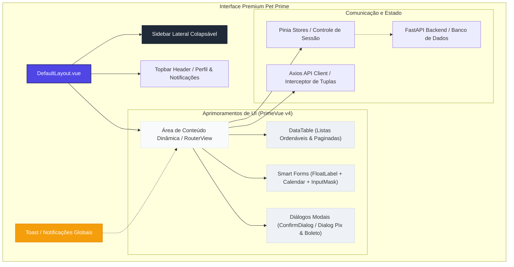
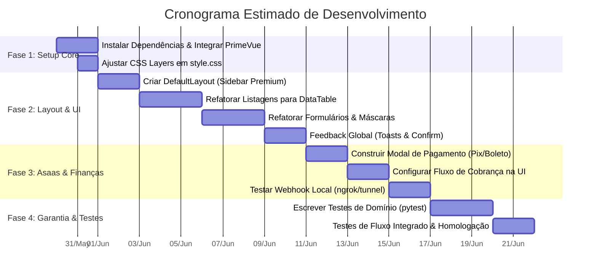
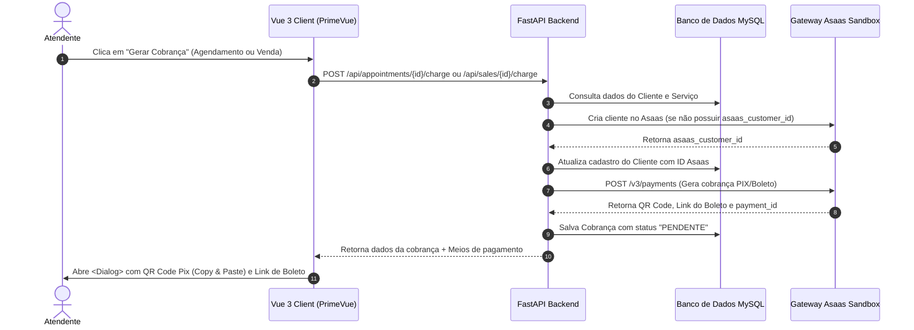

# 📋 Plano de Desenvolvimento Premium - Pet Prime (Layout Prime & Evolução)

Este documento apresenta a especificação técnica e o cronograma detalhado de desenvolvimento para a evolução da plataforma **Pet Prime**. O foco principal é a transformação da interface do usuário em um **Layout Prime** elegante e de alta fidelidade (utilizando **PrimeVue v4** com preset **Aura** integrado de forma nativa ao Tailwind CSS v3), a consolidação das integrações financeiras via **Asaas** e a implementação de testes de qualidade.

---

## 🎨 1. Arquitetura de Design & Layout Prime

Para criar uma experiência premium que impressione à primeira vista, adotaremos uma **arquitetura de layout baseada em painéis modernos (Dashboard Grid)**, com as seguintes características de design:
* **Paleta de Cores Curada (Aura Slate/Indigo)**: Tons neutros de cinza com detalhes sutis em índigo e violeta para as ações primárias, evitando cores primárias brutas.
* **Barra Lateral Colapsável (Responsive Drawer Sidebar)**: Navegação lateral limpa e agrupada por seções de domínio, otimizada para Desktop e Mobile.
* **Micro-animações de Estado**: Efeitos suaves de transição no hover de botões, foco em inputs flutuantes e abertura gradual de diálogos (`transition-all duration-300`).
* **Visual Glassmorphism**: Cards com fundos levemente transparentes e bordas finas para um visual limpo e moderno.



---

## 📅 2. Cronograma Geral das Fases de Evolução



---

## 🛠️ 3. Especificação Detalhada das Fases

### 📦 Fase 1: Preparação do Ambiente e Integração Core
O frontend possui Tailwind CSS v3 configurado, mas carece das dependências do PrimeVue v4. O primeiro passo é a instalação e isolamento de estilos para evitar que as classes do Tailwind sobrescrevam os estilos dos componentes do PrimeVue ou vice-versa.

#### 1. Instalação de Dependências
Executar no diretório `/front/project-front/petshop`:
```bash
npm install primevue@^4.0.0-rc.1 primeicons @primevue/themes
npm install -D tailwindcss-primeui
```

#### 2. Configuração de CSS Layers (`src/style.css`)
Isolar as diretivas do Tailwind e do PrimeVue em camadas (`layers`) CSS para garantir a ordem correta de especificidade:
```css
@layer tailwind-base, primevue, tailwind-utilities;

@layer tailwind-base {
  @tailwind base;
}

@layer tailwind-utilities {
  @tailwind components;
  @tailwind utilities;
}
```

#### 3. Registro do PrimeVue com Tema Aura (`src/main.ts`)
Registrar o PrimeVue utilizando o preset **Aura** no arquivo de entrada:
```typescript
import { createApp } from 'vue'
import PrimeVue from 'primevue/config'
import Aura from '@primevue/themes/aura'
import ToastService from 'primevue/toastservice'
import ConfirmationService from 'primevue/confirmationservice'

import App from './App.vue'
import router from './router'
import './style.css'
import 'primeicons/primeicons.css'

const app = createApp(App)
app.use(PrimeVue, {
    theme: {
        preset: Aura,
        options: {
            darkModeSelector: '.app-dark', // Suporte opcional a modo escuro
            cssLayer: {
                name: 'primevue',
                order: 'tailwind-base, primevue, tailwind-utilities'
            }
        }
    }
})
app.use(ToastService)
app.use(ConfirmationService)
app.use(router)
app.mount('#app')
```

---

### 🏛️ Fase 2: Construção da UI no Padrão Layout Prime
Esta fase consiste em substituir os componentes brutos e estilizações de tabelas/inputs por componentes premium do PrimeVue.

#### 1. Estrutura Global: `DefaultLayout.vue`
Substituir o menu superior simples por um layout com **Sidebar Lateral Fixa e Retrátil** e **Header Superior**:
* **Sidebar (`<Menu>` ou Componente customizado)**:
  * Logotipo do Pet Prime com animação pulsante suave.
  * Grupos de Navegação:
    * **Painel Geral**: Dashboard, Calendário.
    * **Cadastros**: Clientes, Pets, Serviços, Produtos.
    * **Operações**: Vendas, Agendamentos.
  * Perfil do Usuário resumido na base da barra lateral com botão de Logout em cor suave de destaque.
* **Header Superior**:
  * Título dinâmico da página atual.
  * Badges de status rápidos (ex: total de agendamentos pendentes hoje).
  * Menu de perfil suspenso.

#### 2. Tabela de Listagens (`<DataTable>`)
Migrar as tabelas de listagens (`CustomerList.vue`, `PetList.vue`, `AppointmentList.vue`, `ServiceList.vue`, `ProductList.vue`, `SaleList.vue`) para usar o componente avançado do PrimeVue:
* **Ordenação Nativa**: Adicionar `:sortable="true"` em colunas essenciais.
* **Filtros Globais**: Usar `v-model:filters` associado a uma barra de pesquisa rápida no cabeçalho da tabela.
* **Paginação Fluida**: Utilizar paginador integrado (`paginator :rows="10" :rowsPerPageOptions="[5, 10, 20, 50]"`).
* **Badges Customizadas**: Utilizar `<Tag>` para representar os estados (ex: `ATIVO` -> Verde, `INATIVO` -> Vermelho; Agendamento: `Pendente` -> Amarelo, `Agendado` -> Azul, `Concluido` -> Verde, `Cancelado` -> Vermelho).

#### 3. Formulários Inteligentes (Inputs Específicos)
Melhorar drasticamente a experiência do usuário nos formulários de cadastro e edição:
* **Rótulos Flutuantes**: Envolver inputs comuns em `<FloatLabel>` para um design moderno e elegante.
* **Máscaras de Entrada (`<InputMask>`)**:
  * CPF do Cliente: `mask="999.999.999-99"` com validação estrutural.
  * Telefone do Cliente: `mask="(99) 99999-9999"`.
* **Marcação de Consultas (`<Calendar>`)**:
  * Em `AppointmentForm.vue`, usar o componente `<Calendar>` configurado para bloquear datas passadas (`:minDate="new Date()"`) e finais de semana (`:disabledDays="[0, 6]"`), garantindo que as regras de negócio do backend já sejam aplicadas na própria interface.
* **Seleções Relacionadas (`<Dropdown>`)**:
  * Usar `<Dropdown>` com propriedade `filter` ativada para busca rápida de Clientes ao cadastrar Pets, e Pets ao agendar serviços.

#### 4. Feedbacks Visuais (`<Toast>` & `<ConfirmDialog>`)
* **Toasts Globais**: Substituir alertas nativos e gerenciar feedbacks de sucesso ou falha através de `toast.add({ severity: 'success', summary: 'Sucesso', detail: 'Ação executada!' })`.
* **Confirmação de Ações Críticas**: Adicionar o modal `<ConfirmDialog>` nas ações de desativação de clientes, pets ou cancelamento de agendamentos para evitar cliques acidentais.

---

### 💳 Fase 3: Integração e Consolidação Financeira (Gateway Asaas)
Integrar os fluxos de negócios locais com a API Sandbox do Asaas de forma transparente.



#### 🛠️ Mecanismo de Sincronização por Webhook
1. O backend expõe o endpoint `POST /api/webhook/asaas` para escutar notificações do gateway.
2. Quando o cliente realiza o pagamento via Pix ou Boleto no Sandbox, o Asaas envia um evento de transição (`PAYMENT_RECEIVED` ou `PAYMENT_CONFIRMED`).
3. O endpoint valida o cabeçalho `asaas-access-token` configurado no `.env` do backend (`ASAAS_WEBHOOK_TOKEN`) para garantir segurança.
4. O backend localiza a cobrança via `payment_id`, atualiza seu status para `RECEBIDO` e altera automaticamente o status do agendamento ou da venda vinculada para `CONCLUÍDO`.

---

### 🧪 Fase 4: Garantia de Qualidade e Cobertura de Testes
Escrever testes automatizados robustos no backend para blindar as regras de negócio e evitar regressões.

#### 1. Testes Unitários de Regras de Negócio (`pytest`)
Focados em validar isoladamente as validações de domínio em `back/Pet-prime/app/test`:
* **Regras de Agendamento**:
  * Validar bloqueio de agendamento retroativo (passado).
  * Validar bloqueio de agendamento em finais de semana (Sábado/Domingo).
  * Validar bloqueio de agendamento em feriados nacionais através de mock da biblioteca `holidays`.
  * Validar restrições de horários comerciais (expediente).
* **Regras de Cliente e Pet**:
  * Validar integridade estrutural do CPF brasileiro (dígitos verificadores).
  * Validar consistência estrutural do celular (DDD + 9 dígitos).
  * Validar se a desativação de um Cliente altera automaticamente todos os seus Pets vinculados para o status `INATIVO`.

#### 2. Testes de Integração com Banco e Fluxo Completo
* **Migração de Banco de Dados**: Validar que as migrações do Alembic executam com sucesso a partir de uma estrutura limpa até o estado atual.
* **Fluxo de ponta a ponta na API**:
  * Teste integrado simulando: `Criar Usuário -> Autenticação -> Cadastro de Cliente -> Cadastro de Pet -> Criar Agendamento -> Gerar Cobrança`.
  * O teste utilizará um banco de dados de teste (ou SQLite em memória se preferível para velocidade de CI/CD) simulando chamadas HTTP reais via `TestClient` do FastAPI.

---

> [!IMPORTANT]
> **Padrão de Retorno de Tuplas nas Rotas do Backend**
> Lembre-se de manter a compatibilidade do backend com o frontend. O backend envia retornos estruturados como `return objeto, 200` ou `return objeto, 201`. O frontend utiliza um interceptor específico no Axios em `src/services/api.ts` para capturar a tupla de forma automática e transparente. Essa sintaxe de desenvolvimento deve ser mantida intocada e preservada em todas as refatorações.

> [!TIP]
> **Performance e Experiência de Uso (UX)**
> Durante o carregamento assíncrono de dados das tabelas, utilize o componente `<Skeleton>` do PrimeVue no lugar de simples textos "Carregando..." para dar uma sensação moderna de carregamento progressivo da página.
